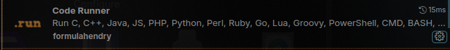
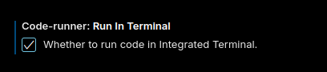
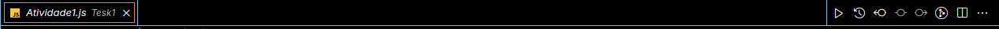

# Atividade 1 +prati

Para rodar os codigos será necessario clonar o repositorio e ter instalado o Nodejs.
Após clonar o repositorio, entre no mesmo, dentro dele está incluso o readline-sync que será necessario para rodar os codigos.
Precisaremos da extenção code runners para rodar os códigos, baixe-a no menu de extenções do vscode e depois no menu de extenções clique na engrenagem ao lado da extenção e vá em "Extension setting" 

Agora procure pela opção "Code runner: Run in terminal" e marque a caixa dela.

Agora apenas precisa selecionar a atividade e clicar no botão play na parte de cima do codigo para a esquerda.

Ou vocẽ pode rodar o código atraves do terminal, para isso será necessario entrar no repositorio clonado, e digitar: node "caminho-do-repositorio/clonado/Atividade1.js" até a ultima sendo a Atividade15.js
